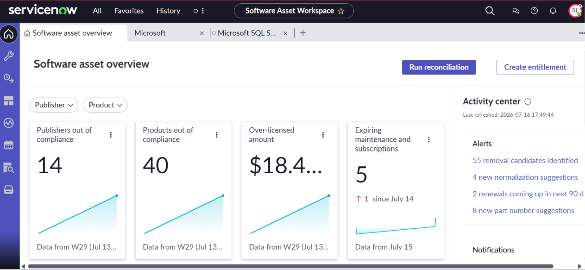

# ServiceNow-Asset-Management-Labs
Practical implementation and documentation of Hardware Asset Management (HAM) in ServiceNow.
# ServiceNow Hardware Asset Management (HAM) Lab

## Overview
This repository documents my practical implementation of the ServiceNow HAM Professional module. I focused on building a compliant, automated hardware lifecycle and maintaining CMDB accuracy.

## Projects Completed

### 1. Hardware Lifecycle & Transfer Orders
* **Objective:** Managed the bulk movement of assets between geographic stockrooms while maintaining audit trails.
* **Process:** Created Source (Toronto) and Destination (Ottawa) stockrooms. Triggered a Transfer Order for MacBook Pro assets.
* **Observation:** Verified automatic substate transitions to 'In Transit' during shipment and 'In Stock' upon receipt.

### 2. Model Normalization & Data Integrity
* **Objective:** Leveraged the HAM Content Service to standardize manufacturer and model data.
* **Process:** Created "dirty" hardware records and utilized the Normalization Engine to achieve 'Normalized' status.
* **Result:** Improved CMDB reliability by ensuring all assets align with the ServiceNow Content Library.

### 3. Secure Asset Disposal
* **Objective:** Simulated a government-standard hardware decommissioning process.
* **Result:** Successfully synchronized Asset 'Retired' states with linked Configuration Items (CIs) to prevent "ghost" infrastructure.

## Technical Skills Used
* ServiceNow CSA (Certified System Administrator)
* CMDB Configuration & Health
* HAM Professional Workflows
* XML Data Export/Import

---

## Project 2: Software Asset Management (SAM) Professional
**Objective:** To automate software license compliance and optimize enterprise-scale software estates.

### 📊 Implementation Highlight: Software Asset Workspace
Below is a simulation of a Software License Audit showing financial optimization and compliance tracking:

### Core Skills & Insights:
* **Financial Optimization:** Identified over **$18.4M** in over-licensed software, demonstrating the ability to drive cost savings through license reclamation.
* **Compliance Management:** Monitored 14 publishers and 40 products out of compliance to ensure an "Audit-Ready" state.
* **Proactive Remediation:** Utilized the Activity Center to triage 55 removal candidates and action normalization suggestions.
* **Entitlement Mapping:** Proficient in importing and reconciling software entitlements against discovered installations.
