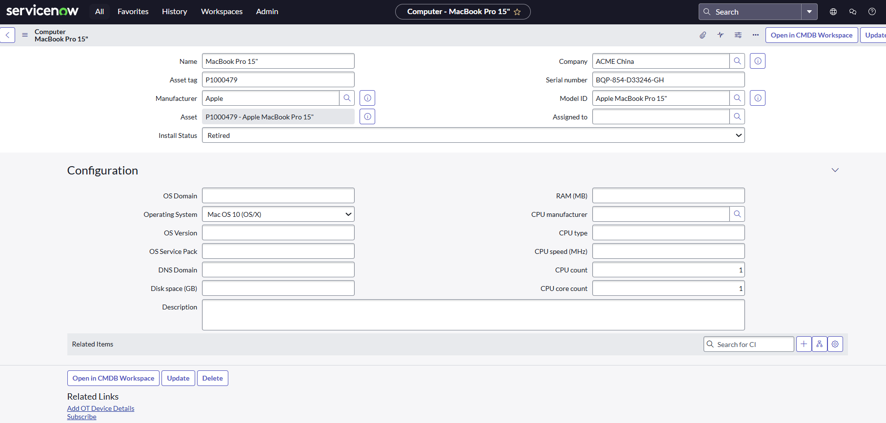
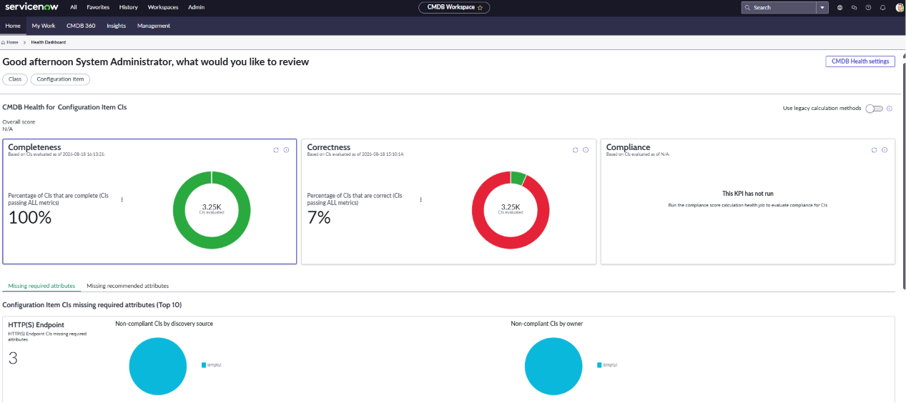

# ServiceNow-Asset-Management-Labs
Practical implementation and documentation of Hardware Asset Management (HAM) in ServiceNow.
# ServiceNow Hardware Asset Management (HAM) Lab

## Overview
This repository documents my practical implementation of the ServiceNow HAM Professional module. I focused on building a compliant, automated hardware lifecycle and maintaining CMDB accuracy.

## Projects Completed

### 1. Hardware Lifecycle & Transfer Orders
* **Objective:** Managed the bulk movement of assets between geographic stockrooms while maintaining audit trails.
* **Process:** Created Source (Toronto) and Destination (Ottawa) stockrooms. Triggered a Transfer Order for MacBook Pro assets.
* **Observation:** Verified automatic substate transitions to 'In Transit' during shipment and 'In Stock' upon receipt.

### 2. Model Normalization & Data Integrity
* **Objective:** Leveraged the HAM Content Service to standardize manufacturer and model data.
* **Process:** Created "dirty" hardware records and utilized the Normalization Engine to achieve 'Normalized' status.
* **Result:** Improved CMDB reliability by ensuring all assets align with the ServiceNow Content Library.

### 3. Secure Asset Disposal
* **Objective:** Simulated a government-standard hardware decommissioning process.
* **Result:** Successfully synchronized Asset 'Retired' states with linked Configuration Items (CIs) to prevent "ghost" infrastructure.

## Technical Skills Used
* ServiceNow CSA (Certified System Administrator)
* CMDB Configuration & Health
* HAM Professional Workflows
* XML Data Export/Import

---

## Project 2: Software Asset Management (SAM) Professional
**Objective:** To automate software license compliance and optimize enterprise-scale software estates.

### 📊 Implementation Highlight: Software Asset Workspace
Below is a simulation of a Software License Audit showing financial optimization and compliance tracking:

### Core Skills & Insights:
* **Financial Optimization:** Identified over **$18.4M** in over-licensed software, demonstrating the ability to drive cost savings through license reclamation.
* **Compliance Management:** Monitored 14 publishers and 40 products out of compliance to ensure an "Audit-Ready" state.
* **Proactive Remediation:** Utilized the Activity Center to triage 55 removal candidates and action normalization suggestions.
* **Entitlement Mapping:** Proficient in importing and reconciling software entitlements against discovered installations.

## Project 3: CSDM 4.0 Architecture & Service Mapping
**Objective:** To implement a service-centric CMDB that maps technical infrastructure to business outcomes.

### 📍 Implementation Highlight: Top-Down Service Map
This map visualizes the relationship between a technical Linux endpoint and the "TD-Mobile-Banking-Prod" Application Service.

### Core Skills & Insights:
* **Service-Awareness:** Demonstrated the ability to create "Application Services" that provide visibility into the business impact of infrastructure failures.
* **CSDM Alignment:** Mapped technical CIs across the **Technical Service** and **Application** domains of the Common Service Data Model.
* **Incident Readiness:** This mapping enables automated "Impact Calculation" during Major Incidents, reducing the time required to identify affected business products.

## Project 4: CMDB Health & Data Governance
**Objective:** To establish a "Single Source of Truth" by monitoring and remediating CMDB data quality across the "3 Cs": Completeness, Correctness, and Compliance.

### 🔍 Implementation Highlight: CMDB Health Dashboard
This dashboard identifies critical data integrity gaps, allowing for targeted remediation of duplicate and stale records.

### Core Skills & Insights:
* **Data Integrity (Correctness):** In this lab, I identified a 7% Correctness score, highlighting high volumes of **Duplicate CIs**. I am proficient in using the **IRE (Identification & Reconciliation Engine)** to remediate these duplicates and prevent future data corruption.
* **Audit Readiness (Completeness):** Achieved a 100% Completeness score for critical infrastructure by configuring **Required and Recommended Fields** within the **CI Class Manager**.
* **Governance Reporting:** Utilized scheduled jobs (`sysauto_script`) to automate health score calculations, providing executive stakeholders with real-time visibility into the health of the banking asset estate.

## Project 4: Hardware Lifecycle Automation & CI Synchronization
**Objective:** To automate the lifecycle transition between financial assets and technical configuration items (CIs) to ensure CMDB data fidelity.

### 🤖 Implementation Highlight: Automated Decommissioning
The screenshot below demonstrates the successful synchronization between the **Asset [alm_asset]** and **Computer [cmdb_ci_computer]** tables.

### Core Skills & Insights:
* **Asset-CI Mapping:** Configured the platform logic so that retiring a financial asset automatically updates the **Install Status** to 'Retired' on the technical CI.
* **Security & Governance:** This automation eliminates "Ghost Assets"—decommissioned hardware that remains 'Active' in monitoring systems—thereby reducing the attack surface and improving operational security.
* **Audit Readiness:** Maintains 100% synchronization between Procurement records and the technical CMDB without manual data entry.

